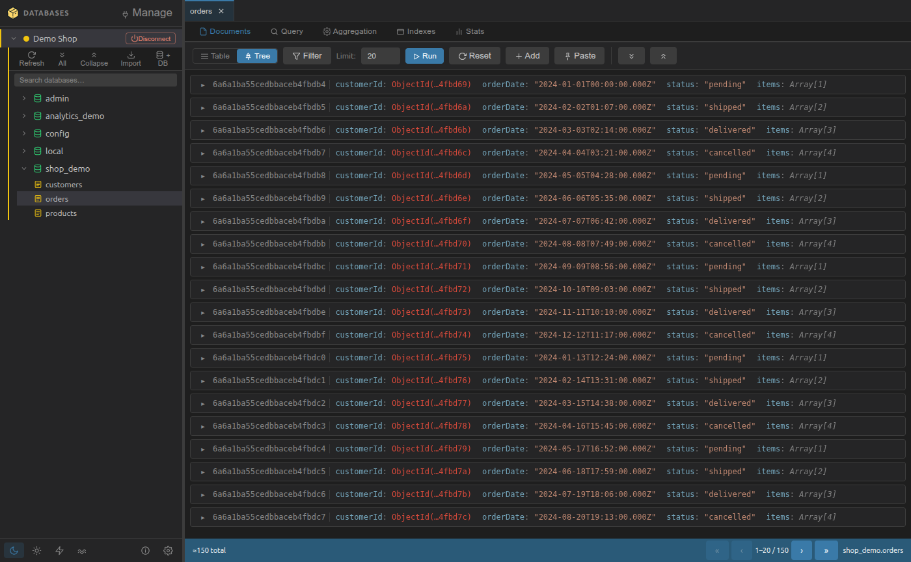
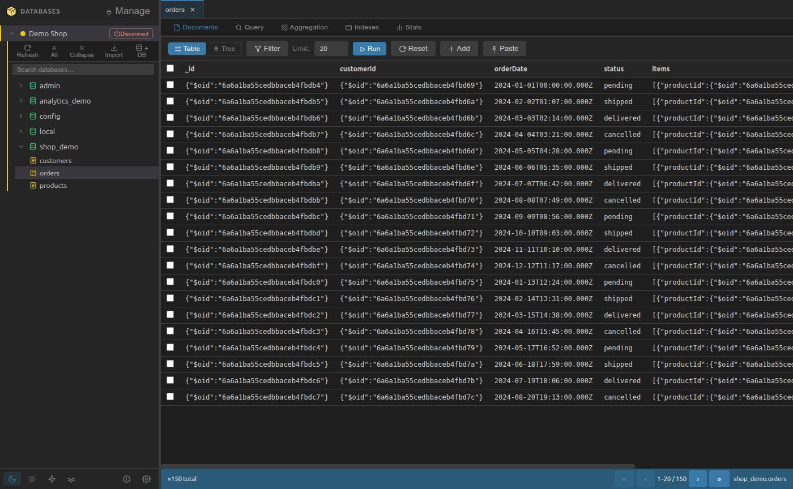
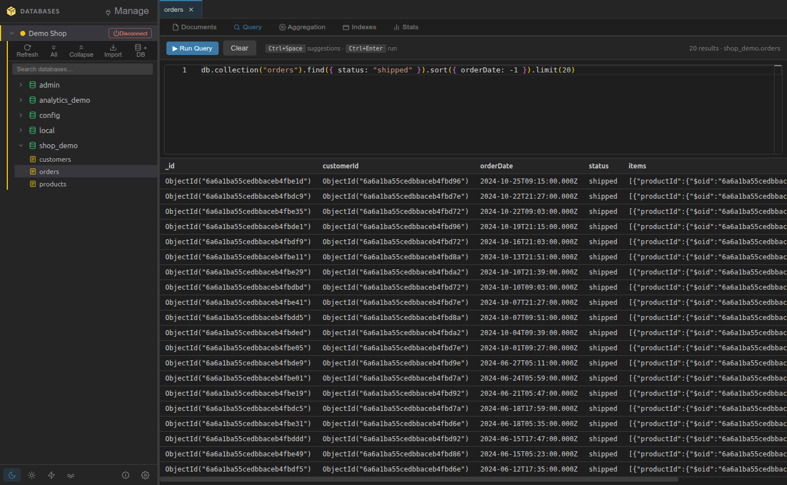
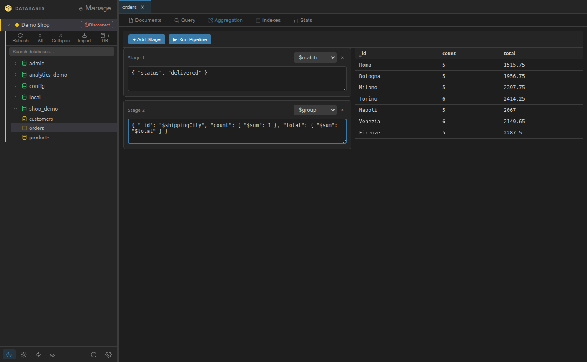
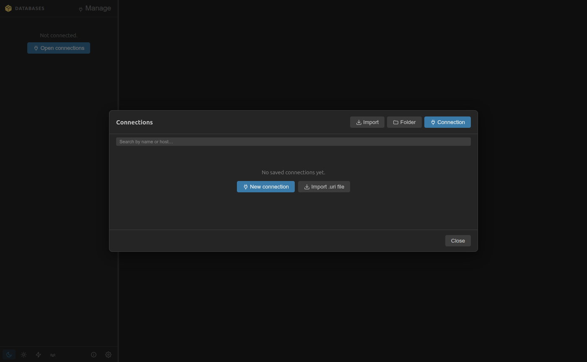
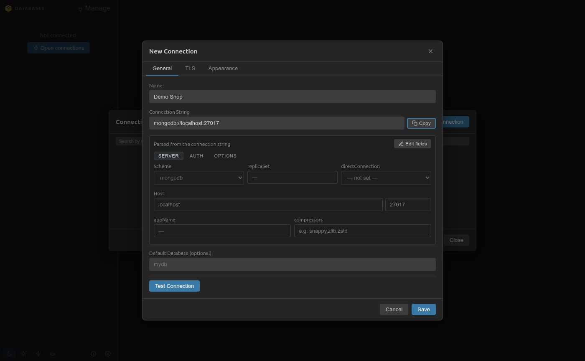

# BoxyNoSql

Desktop NoSQL GUI client. Explore connections, databases, collections and documents.

## Features

- ✅ Connection management (saved in `~/.config/BoxyNoSql/connections.json`)
- ✅ Folder organization with drag & drop, color coding
- ✅ Database/collection tree view with search, plus a command palette (`Ctrl+P`) over connections, databases, collections and actions
- ✅ Document viewer (tree + table), multi-select, bulk copy/paste/delete and bulk field edit (set/rename/unset across the selection)
- ✅ Paginated document browsing with configurable limit
- ✅ Server-side sort (click a column, shift-click for a second key) and per-collection field visibility
- ✅ Query history per collection (filters, queries, pipelines) with named saved queries, kept across restarts
- ✅ Pinned collections, restored last session, connection health with auto-reconnect
- ✅ Shortcut cheat sheet (F1), guided welcome screen, connection clone, CSV/TSV import
- ✅ Document view/edit with JSON syntax highlighting, shell-style `ObjectId(...)` / `ISODate(...)`
- ✅ Query terminal with Monaco editor: autocompletion (Ctrl+Space), Mongo method/operator/field suggestions, Ctrl+Enter to run, resizable split
- ✅ Aggregation pipeline builder with a Monaco editor per stage, completions, stage templates and a document counter per stage
- ✅ Index management (create/drop) with usage stats
- ✅ Collection stats and a schema explorer (sampled field list with types, presence and example values)
- ✅ Copy a collection or a whole database across connections, with a confirmation naming both ends and an automatic refresh of the target
- ✅ Import from JSON / NDJSON at three levels (document, collection, full database)
- ✅ Export to JSON / NDJSON / CSV through a native save dialog: the current filtered+sorted view, the whole collection, or a query/aggregation result
- ✅ User/role management per database
- ✅ Per-tab persistent state: switching between collections/views keeps filters and results
- ✅ Read-only connections: a per-connection flag that refuses every write in the main process, not just in the UI
- ✅ Typed confirmation on drop/clear: retype the name, with the document count shown up front
- ✅ Four themes: dark 🌙 / light ☀️ / high-contrast ⚡ / solarized 🌊

## Screenshots

| | |
|---|---|
| **Documents — tree view**  | **Documents — table view**  |
| **Query terminal**  | **Aggregation pipeline builder**  |
| **Connection manager**  | **Connection string breakdown**  |

*(Dark theme shown; light, high-contrast and solarized are also available. Sample data, no real servers or data pictured.)*

## Roadmap

Planned, not shipped. 🔥 = high impact, low effort.

### Productivity

- ⬜ **Explain plan** — run `explain()` on the current query or pipeline and see index usage, documents examined and stage timings

### Comfort & discoverability

- ⬜ **Large collections without the freeze** — virtualized rows and streamed pages so a big result set scrolls instead of locking the UI

## Install

```bash
npm install
```

## Development

```bash
npm run dev    # start Vite + tsc watchers
npm start      # open Electron (after dev server is up)
npm run check  # typecheck main + renderer, lint, then run the tests
```

### Keyboard

`Esc` cancels the innermost thing open, everywhere. `Alt+Enter` runs the current filter, query or pipeline (`Ctrl+Enter` also works in the editors). `F1` lists every other shortcut.

## Build

```bash
npm run electron:build:linux   # .deb + AppImage
npm run electron:build:win     # NSIS installer
npm run electron:build:all     # both
```

Installers are written to `release/`.

**Windows users:** see [INSTALL_WINDOWS.md](INSTALL_WINDOWS.md) for install, build and troubleshooting steps.

## Usage

1. Open the app
2. Click `🔌 +` to add a connection (or right-click the sidebar)
3. Enter name and connection string (e.g. `mongodb://localhost:27017`)
4. Double-click connection to connect
5. Click a collection to open it

## Mongo test docker

```bash
docker run -d --name mongodb-dev -p 27017:27017 -e MONGO_INITDB_ROOT_USERNAME=admin -e MONGO_INITDB_ROOT_PASSWORD=secret mongo:7

docker exec -it mongodb-dev mongosh -u admin -p secret --authenticationDatabase admin
```

## License

MIT — see [LICENSE](LICENSE)
