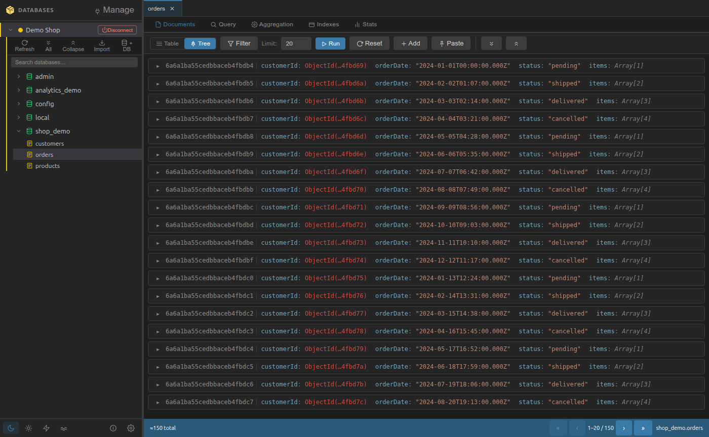
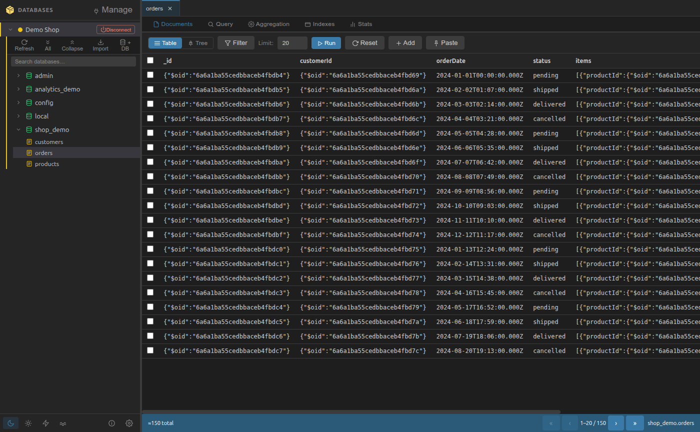
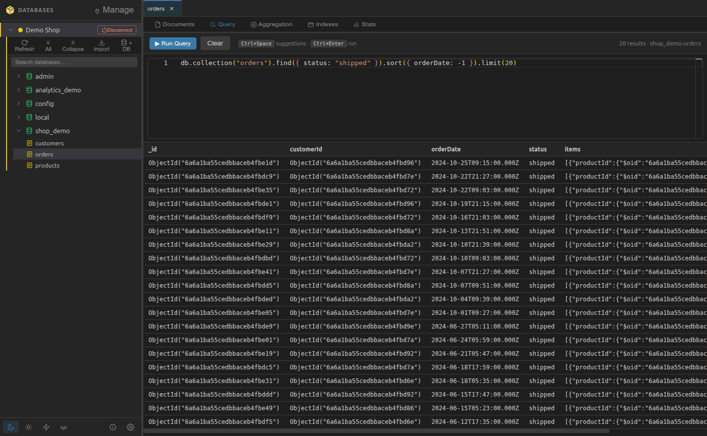
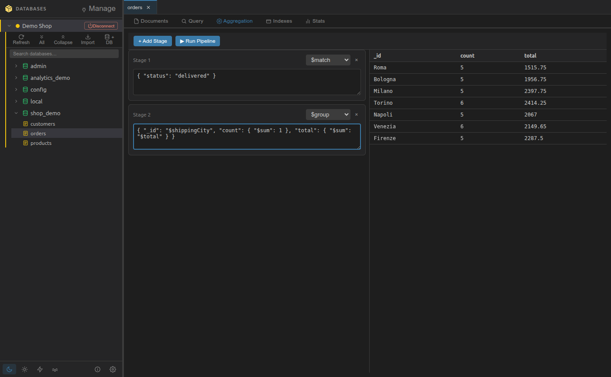
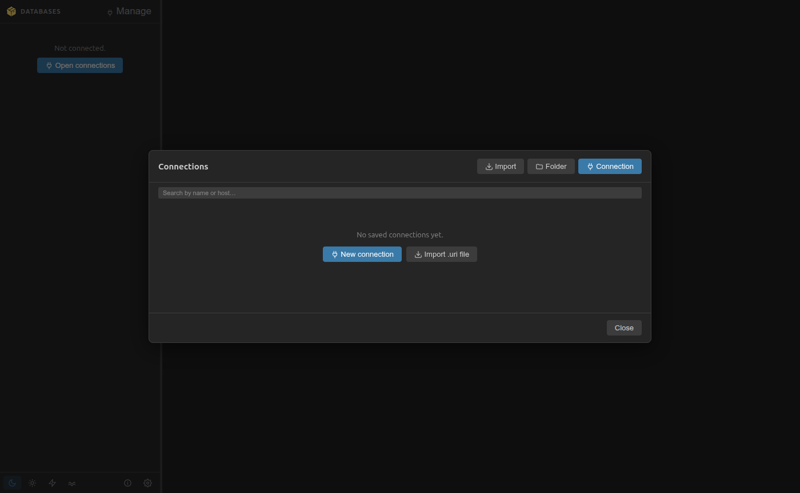
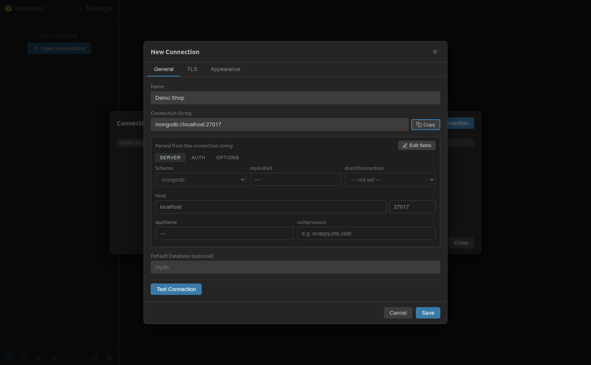

# BoxyNoSql

Desktop NoSQL GUI client. Explore connections, databases, collections and documents.

## Features

- ✅ Connection management (saved in `~/.config/BoxyNoSql/connections.json`)
- ✅ Folder organization with drag & drop, color coding
- ✅ Import connections from a Studio 3T `.uri` export: folders, colors and client certificates come along, Studio 3T-only options are translated or stripped
- ✅ Database/collection tree view with search, plus a command palette (`Ctrl+P`) over connections, databases, collections and actions
- ✅ Document viewer (tree + table), multi-select, bulk copy/paste/delete and bulk field edit (set/rename/unset across the selection)
- ✅ Paginated document browsing with configurable limit
- ✅ Server-side sort (click a column, shift-click for a second key) and per-collection field visibility
- ✅ Query history per collection (filters, queries, pipelines) with named saved queries, kept across restarts
- ✅ Pinned collections, restored last session, connection health with auto-reconnect
- ✅ Shortcut cheat sheet (F1), guided welcome screen, connection clone, CSV/TSV import
- ✅ Document view/edit with JSON syntax highlighting, shell-style `ObjectId(...)` / `ISODate(...)`, foldable sections with expand/collapse all, and find
- ✅ Query terminal with Monaco editor: autocompletion (Ctrl+Space), Mongo method/operator/field suggestions, Ctrl+Enter to run, resizable split
- ✅ Aggregation pipeline builder with a Monaco editor per stage, completions, stage templates and a document counter per stage
- ✅ Explain plan on the current filter, query or pipeline: index used or collection scan, documents and keys examined, stage timings, a verdict when far more is read than returned, and the raw output one click away
- ✅ Index management (create/drop) with usage stats
- ✅ Collection stats and a schema explorer (sampled field list with types, presence and example values)
- ✅ Copy a collection or a whole database across connections, with a confirmation naming both ends and an automatic refresh of the target
- ✅ Import from JSON / NDJSON at three levels (document, collection, full database)
- ✅ Export to JSON / NDJSON / CSV through a native save dialog: the current filtered+sorted view, the whole collection, or a query/aggregation result
- ✅ User/role management per database
- ✅ Per-tab persistent state: switching between collections/views keeps filters and results
- ✅ Large pages without the freeze: both document views are windowed, so only the rows near the viewport are in the DOM and a limit of a few thousand scrolls instead of locking up
- ✅ Read-only connections: a per-connection flag that refuses every write in the main process, not just in the UI
- ✅ Typed confirmation on drop/clear: retype the name, with the document count shown up front
- ✅ Four themes: dark 🌙 / light ☀️ / high-contrast ⚡ / solarized 🌊, adjustable text size (80 / 100 / 120%)
- ✅ Sound cues on connect, disconnect, tree refresh, a successful connection test and connection errors (can be turned off)

## Screenshots

| | |
|---|---|
| **Documents — tree view**  | **Documents — table view**  |
| **Query terminal**  | **Aggregation pipeline builder**  |
| **Connection manager**  | **Connection string breakdown**  |

*(Dark theme shown; light, high-contrast and solarized are also available. Sample data, no real servers or data pictured.)*

## Roadmap

- [ ] **AppImage sandbox flags baked in for every launch, not just the documented `.desktop` entry.** `--no-sandbox --disable-namespace-sandbox` (see `main.ts`'s top comment) fixes GNOME dash launches, and a second Ubuntu machine also hit the plain SUID FATAL on a bare, no-args launch — so the namespace-sandbox fallback isn't reliably available even for a direct launch, host-dependent. The only channel that gets the flags today is `INSTALL_LINUX.md`'s recommended `.desktop` `Exec=` line (and the matching `build.appImage.executableArgs` default for any integration tool that reads the AppImage's own internal desktop entry) — a raw `./BoxyNoSql.AppImage` with zero args, on a host where the fallback fails, still crashes.

  Two things ruled out, so a future session doesn't retry them: `app.commandLine.appendSwitch()` from JS doesn't reliably reach whatever the SUID/namespace decision depends on (reproduced the FATAL with it anyway); `app.relaunch()` to force the flags onto a fresh argv crashes the packaged AppImage natively before any JS runs, because it re-execs the inner `boxynosql` binary directly and skips `AppRun`'s `LD_LIBRARY_PATH`/`XDG_DATA_DIRS`/etc. setup.

  Design (not yet implemented): patch electron-builder's generated `AppRun` script itself, so the flags apply to *every* launch of the AppImage without bypassing it. `AppRun` is a plain bash script (`exec "$BIN" "${args[@]}"`, unconditionally, whatever argv it was given) written fresh by `AppImageTarget`'s `build()` during `electron-builder`'s AppImage-specific packaging step — no existing config option controls its content (`executableArgs` only affects the *internal* `.desktop` file's `Exec=`, not `AppRun`). Needs a post-build step — likely `electron-builder afterPack` doesn't fire late enough (AppImage-specific staging happens after `afterPack`, per `AppImageTarget.js`), so this probably means locating the produced `release/__appimage-x64/AppRun` (or equivalent staging dir electron-builder uses before invoking `appimagetool`) between `build:renderer` and the final squashfs assembly, and sed/patching its `exec "$BIN"` line to `exec "$BIN" --no-sandbox --disable-namespace-sandbox "${args[@]}"` — or dropping electron-builder's AppImage target and driving `appimagetool` directly from a custom `AppRun`, trading electron-builder's convenience for full control. Worth a spike to find electron-builder's actual staging path/timing before committing to either approach.
- [ ] **Search reaching collections whose database was never expanded.** The sidebar's search box (`Sidebar.tsx` `db-search-input`) already matches collection names, not just database names (`matchingCols`, auto-expands a db that only matched through a collection) — but it filters `collections[connId][db]`, which `App.tsx`'s `handleExpandDb` only populates lazily, on that db's first manual expand. Typing a collection name today only finds it if its parent db happens to already be expanded; an unexpanded db's collections are invisible to search. `CommandPalette` has the same gap, for the same reason (`collections[connId]` is its source too, per its own comment: it "deliberately does not list databases it has not fetched, or the palette would hit every server on each keystroke").

  Design (not yet implemented):
  - No server-side "search collections across databases" primitive exists in MongoDB — reaching an unfetched db's collections always means calling `get-collections` for it, same IPC `handleExpandAll` already batches for one connection's "Expand all" button.
  - Stay explicit, matching the app's existing stance (schema sampling, palette's own db-listing) of never firing background requests just because a keystroke happened: don't fetch-as-you-type. Instead, when a search term matches no already-loaded database or collection name, show a hint under the (empty) results — e.g. "12 databases not expanded — search there too?" — with a button that does the one-time batched `get-collections` fetch (mirrors `handleExpandAll`'s `Promise.all` over the not-yet-loaded databases of that connection) and merges into the existing `collections` state.
  - Once merged, the existing `matchingCols`/`filteredDbs` filtering in `Sidebar.tsx` needs no changes — it already searches whatever's in `collections[connId]`. `CommandPalette`'s item list (built in `App.tsx`) benefits the same way for free, since both read the same state.
  - Debounce the button's appearance (only offer it after the user pauses typing, not on every keystroke) so a fast typist doesn't see it flash on intermediate substrings.
  - Cap or explicitly warn for connections with a very large database count before firing that many `get-collections` calls at once — no cap exists on `handleExpandAll` today either, but that's a user-initiated "Expand all" click, not a per-keystroke-adjacent action; worth deciding a threshold (e.g. warn past ~30 databases) rather than copying that precedent blindly.
  - Files to touch: `App.tsx` (new handler alongside `handleExpandDb`/`handleExpandAll`), `Sidebar.tsx` (the hint + button, no filtering-logic changes), possibly `utils/palette.ts` only if the hint should also surface from `Ctrl+P`.

- [ ] **Editing an existing user's roles**, for on-server user/permission management. `UsersRolesModal.tsx` + `main.ts` today only cover `list-users`, `create-user` (one role, implicitly the open database) and `drop-user` — there's no `update-user`-shaped IPC at all, so granting or revoking a role from a user that already exists means dropping and recreating them (loses their password, which the app never sees again after creation).

  Design (not yet implemented):
  - New IPC `update-user-roles(connectionId, dbName, username, roles)` in `main.ts`, next to the existing users handlers, gated by `assertWritable(connectionId)` like every other write handler. Runs `client.db(dbName).command({ updateUser: username, roles })` — a full replace of the roles array (Mongo's own semantics for that command), simpler and more predictable than diffing individual `grantRolesToUser`/`revokeRolesFromUser` calls.
  - A role isn't necessarily scoped to the open database (`{role, db}` pairs — e.g. `readAnyDatabase` on `admin`), and today's create-user form only takes one role string on the current db — same gap, worth fixing alongside this rather than building edit on top of a narrower create. Both forms should share one "role list editor": add/remove rows, each row a role name (free text, or a datalist merging `BUILTIN_ROLES` with whatever `list-roles` returns for custom roles) plus a db field defaulting to the open database.
  - Edit entry point: a pencil/edit action per row in the Users tab's list, opening the role list editor pre-populated from that user's current `roles` (already returned by `list-users`'s `usersInfo` result) — an actual edit, not a blank form the admin has to reconstruct from memory.
  - Before committing, show the diff (roles added / roles removed) rather than silently replacing — same reasoning `utils/bulkEdit.ts` + `BulkEditModal.tsx` already documents for bulk field edits: "a bulk write is where 'what exactly is about to happen' has to be answerable." A small pure `diffRoles(current, next)` helper (unit-testable, mirroring `bulkEdit.ts`'s shape) returning `{added, removed}` covers both the confirmation dialog and the modal's own preview.
  - Worth flagging, not necessarily solving: revoking a role from the very account the app is currently connected as (e.g. dropping your own `userAdmin`) can lock that connection out of managing users further. The app doesn't reliably know which username a connection authenticates as (would need parsing it back out of the stored URI) — at minimum, `showConfirm` before applying, not a silent save; a same-username-as-the-connection's-own heads-up is a nice-to-have on top, not a blocker.
  - Password change (`updateUser` also takes `pwd`) is a natural extension once this form exists, but out of scope for what was actually asked (roles only) — note it, don't build it unprompted.
  - Files to touch: `main.ts` (new handler), `UsersRolesModal.tsx` (edit action, shared role-list editor for create + edit), a new `utils/userRoles.ts` for `diffRoles`/validation (duplicate role+db pairs, empty role name) with a matching `__tests__` file.

- [ ] **A single click anywhere on a database row expands/collapses it; should require a double-click or a click on the chevron instead.** `Sidebar.tsx`'s db row (`tree-node-header`, ~line 177) puts `onClick={() => onExpandDb(connId, db)}` on the whole row — clicking the label, the icon or empty space all toggle expansion, not just the chevron (`<span className="tree-chevron">`, line 190). That makes the row impossible to click for anything else (e.g. a future "select without expanding") without also toggling the tree.

  Design (not yet implemented):
  - Move the expand `onClick` off the row and onto the chevron span only (line 190): `<span className="tree-chevron" onClick={e => { e.stopPropagation(); onExpandDb(connId, db); }}>`.
  - Add `onDoubleClick={() => onExpandDb(connId, db)}` on the row itself (line 177-189) as the second way in; the row's own `onClick` becomes a no-op (or just drops, since nothing else currently needs a single-click handler there).
  - Keep the existing `onKeyDown` Enter-to-expand (line 183) untouched — this is a mouse-only complaint, keyboard nav already works.
  - Known minor overlap, not worth solving: double-clicking precisely on the 12px chevron fires one `onClick` (expand) then the row's `onDoubleClick` (expand again) on the same pair of clicks, i.e. toggles twice back to the start state. Fine in practice — the chevron is a tiny target and a stray double-click there just re-lands on the same open/closed state.
  - Same pattern doesn't exist on collection rows (`onClick={() => onSelectCollection(...)}`, line 206) or the connection row (`onClick={() => onSelectConnection(...)}`, line 249) — both are already single-purpose selects, not expand toggles, so this is scoped to the db row only.
  - Files to touch: `Sidebar.tsx` (db row `onClick`/`onDoubleClick`, ~line 177-198).

- [ ] **Right-click on a database → open a shell (query terminal) scoped to the whole database, not one collection.** Today the query terminal is only reachable per-collection, and `QueryTerminal.tsx` is built around exactly one: `collection: string` is a required prop, the default query text is `db.collection("${collection}").find({}).limit(20)` (line 37), and the namespace label at the bottom reads `{database}.{collection}` (line 196). The backend doesn't actually need a collection, though — `run-query` (`main.ts:703`) evals user code against the *whole* `db` handle (`client.db(dbName)`, then `new Function('db', ...)`); the `collection` argument it receives is unused inside the eval. `explain-query` (`main.ts:814`) is the same, its `collection` param already named `_collection` to mark it unused. So `db.getCollectionNames()`, `db.stats()`, `db.otherCollection.find()` etc. already work today if a query tab could just be opened without picking one collection first — only the renderer forces the choice.

  Design (not yet implemented):
  - `Tab.collection` (`App.tsx:53`) is already optional, so a db-shell tab is representable today: `openTab('query', dbName, dbName, undefined, connId)` (reusing `openTab`, `App.tsx:961`) produces exactly that. Add a `handleOpenDbShell(connId, dbName)` next to `handleSelectCollection` (`App.tsx:955`) that calls it.
  - `MainContent.tsx`'s `renderPane` (line 275) currently has `if (!database || !collection) return null;` guarding every view type alike — this would blank a collection-less query tab. Needs a `viewType === 'query' ? !database : !database || !collection` split (or move the collection check into the other `case`s), and `collection={collection}` passed to `QueryTerminal` (line 282) becomes `collection={collection ?? null}`.
  - `QueryTerminal.tsx`: make `collection` accept `string | null` (line 14/36). When `null`: default query text falls back to something collection-less, e.g. `db.getCollectionNames()`; the sample-fields fetch effect (line 79-92, calls `get-documents` for Monaco completions) skips entirely — no sample collection to seed from, static `db.`-method/operator completions still apply; the bottom namespace label (line 196) renders just `{database}` instead of `{database}.{collection}`; `useQueryHistory('query', connectionId, database, collection)` (line 94) needs a defined scope for the no-collection case — pass an explicit sentinel (e.g. `'*'`) rather than `null`, since `scopeKey()` (`utils/queryHistory.ts:41`) just template-joins whatever it's given and a stable sentinel keeps db-shell history separate from any real collection named the same.
  - `Sidebar.tsx`: add an `{ label: 'Open shell', icon: 'search', onClick: () => { onOpenDbShell(dbCtxMenu.connId, dbCtxMenu.db); setDbCtxMenu(null); } }` entry to `dbCtxItems` (line 289), reusing the `search` icon already used for the Query tab type (`MainContent.tsx:63`, `TAB_TYPES`). New `onOpenDbShell` prop threaded through `SidebarProps` the same way `onManageUsers`/`onCreateCollection` already are.
  - No `main.ts` changes needed — `run-query`/`explain-query` already ignore the `collection` argument for the eval itself; the renderer can pass `''` or `null` for it without touching the IPC signature.
  - Files to touch: `Sidebar.tsx` (context menu entry + prop), `App.tsx` (new `handleOpenDbShell`, prop threading), `MainContent.tsx` (`renderPane`'s collection guard, tab title for a collection-less query tab), `QueryTerminal.tsx` (optional collection: default query, skip sample-fields fetch, namespace label, history scope sentinel).

Everything else that was on it has shipped — see the Features list above and `CHANGELOG.md`.

## Install

```bash
npm install
```

## Development

```bash
npm run dev    # start Vite + tsc watchers
npm start      # open Electron (after dev server is up)
npm run check  # typecheck main + renderer, lint, then run the tests
```

### Keyboard

`Esc` cancels the innermost thing open, everywhere. `Alt+Enter` runs the current filter, query or pipeline (`Ctrl+Enter` also works in the editors). `F1` lists every other shortcut.

## Build

```bash
npm run electron:build:linux   # .deb + AppImage
npm run electron:build:win     # NSIS installer
npm run electron:build:all     # both
```

Installers are written to `release/`.

**Windows users:** see [INSTALL_WINDOWS.md](INSTALL_WINDOWS.md) for install, build and troubleshooting steps.

**Linux/Ubuntu users:** see [INSTALL_LINUX.md](INSTALL_LINUX.md) — `.deb` vs AppImage, auto-update (AppImage only), pinning the AppImage to the dock, and troubleshooting.

## Usage

1. Open the app
2. Click `🔌 +` to add a connection (or right-click the sidebar)
3. Enter name and connection string (e.g. `mongodb://localhost:27017`)
4. Double-click connection to connect
5. Click a collection to open it

## Mongo test docker

```bash
docker run -d --name mongodb-dev -p 27017:27017 -e MONGO_INITDB_ROOT_USERNAME=admin -e MONGO_INITDB_ROOT_PASSWORD=secret mongo:7

docker exec -it mongodb-dev mongosh -u admin -p secret --authenticationDatabase admin
```

## License

MIT — see [LICENSE](LICENSE)
